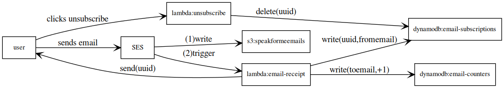

# infrastructure

Infrastructure Components for Speakforme campaign. 

Writing our Infrastructure as Code allows us to make easier changes, rollback if needed,
and most importantly - allow everyone to contribute to the infrastructure.

## Directory Structure

```
infrastructure/
├── api.tf
├── data.tf (IAM Policies)
├── dns.tf (DNS Records)
├── dynamodb.tf (DynamoDB Tables)
├── iam.tf (IAM policies and role attachment)
├── lambda (Lambda code)
│   ├── email-receipt
│   └── unsubscribe
├── lambda.tf (Create lambda on AWS)
├── output.tf (Output variables)
├── permissions.tf (AWS Lambda Permissions)
├── policies.tf (IAM policy and documents)
├── provider.tf (Terraform providers)
├── README.md
├── s3.tf (S3 Bucket)
└── ses.tf (SES configuration)
```

## How does it work?

We run entirely off Terraform, AWS (SES+Lambda+DynamoDB).

The website part of it is at [speakforme/website](https://github.com/speakforme/website).
We mark ourselves in the bcc (`bcc@email.speakforme.in`). This is caught by SES, which triggers
a Lambda job.

The Lambda job:

-   [x] Generates a UUID.
-   [x] Saves the from email in dynamoDB against the UUID.
-   [x] Sends an acknowledgement email with a unsubscription link that has the UUID.
-   [x] Bumps counters in another table for every email marked on the email

Here's a graph:



The unsubscription link triggers another Lambda job which:

-   [ ] Deletes the email entry from the DynamoDB using the UUID.
